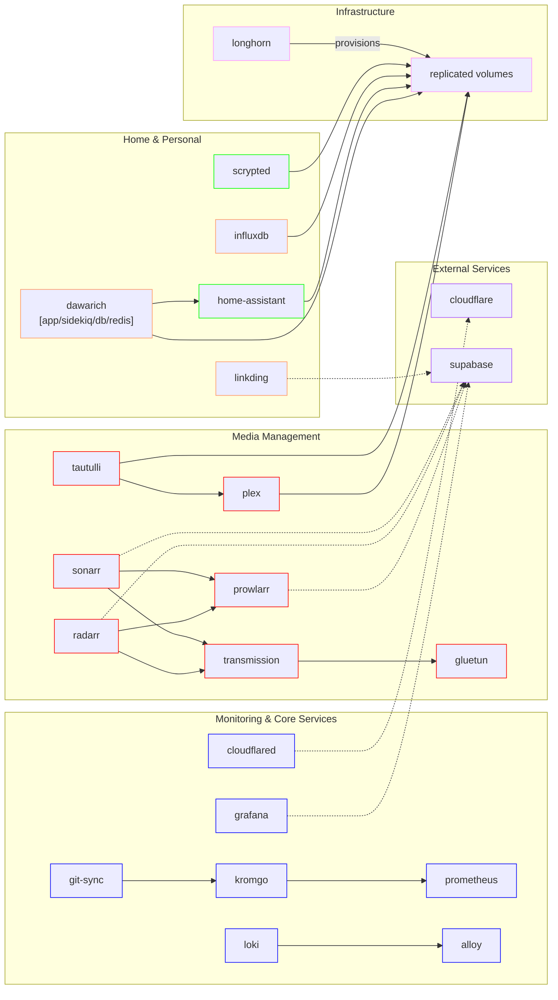
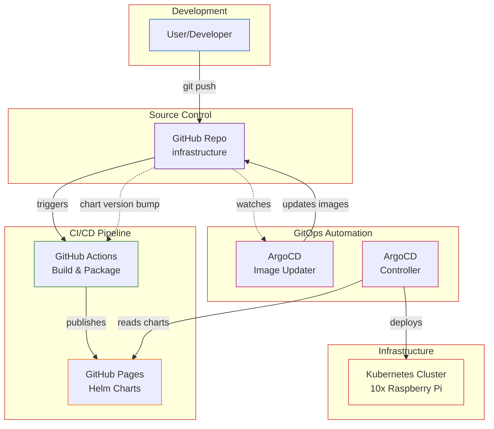
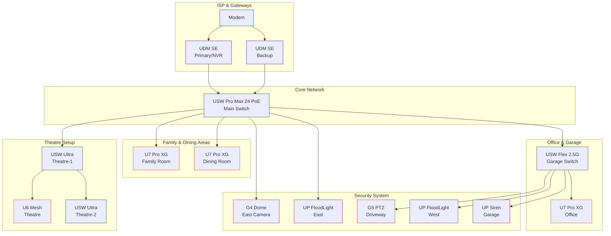
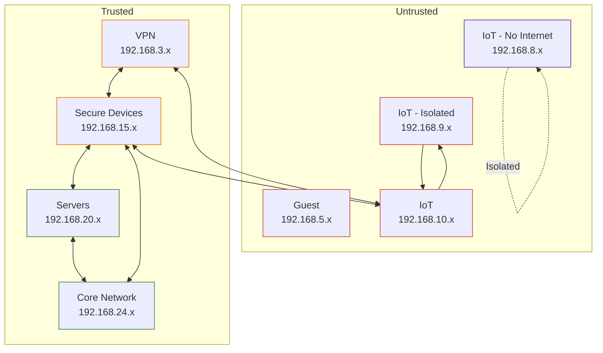
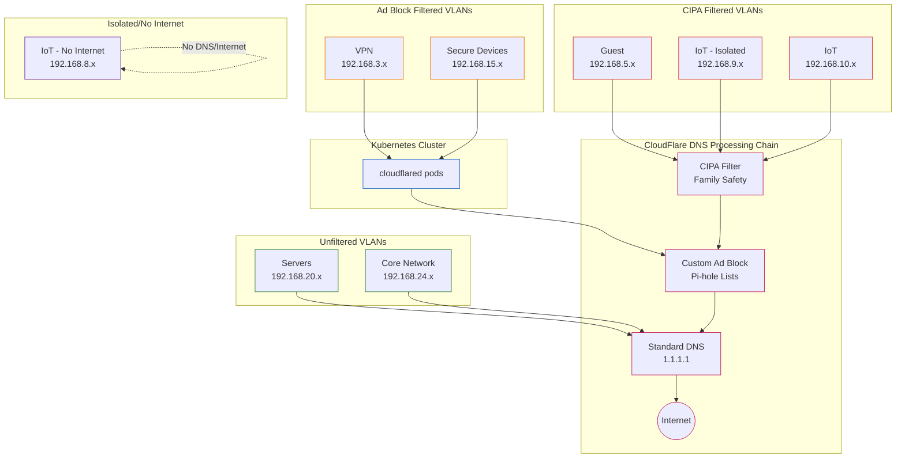

# Fiorali Infrastructure Operations Repository

Kubernetes cluster managed with ArgoCD and GitHub Actions, using Longhorn for persistent storage

[](https://k3s.io)
[](https://dietpi.com)
[](https://argo-cd.readthedocs.io/en/stable)


This is a mono repository for my home infrastructure and Kubernetes cluster. I try to adhere to Infrastructure as Code (IaC) and GitOps practices using tools like [ArgoCD](https://argo-cd.readthedocs.io/en/stable), [Kubernetes](https://kubernetes.io), and [GitHub Actions](https://github.com/features/actions).

## Kubernetes

The Kubernetes cluster is running across 10 Raspberry Pi's, where 5 of the nodes are Raspberry Pi 4's (worker nodes), and the other 5 are Raspberry Pi 5's (master nodes). Node names are denoted with a numeric suffix, depending on their physical placement in the server room.

| Hardware Model  | Node Name   | Role   | Storage   |
|-----------------|-------------|--------|-----------|
| Raspberry Pi 4  | rpi4-node-x | worker | 500GB USB |
| Raspberry Pi 5  | rpi5-node-x | master | 2TB SSD   |

In a typical setup, workloads are only provisioned on worker nodes. However given the compute requirements for the entire cluster, workloads are provisioned across all nodes. In essence the only discernable difference between master and worker nodes is that `kubectl` commands can be run against the master nodes.

## Storage

Storage is handled by [Longhorn](https://longhorn.io). Storage is split between node types (you can reference the [Kubernetes hardware for details](#kubernetes)).

Given the speed difference between the two disk types (SSD vs USB), slower long term volumes are provisioned on the USB drives while the volumes that require speed are stored on the SSD's. The majority of volumes are configured with 2 replicas in the event a single node goes down.

A small subset (~5G) of "critical" data is [sent to an Amazon S3 bucket](https://ca-central-1.console.aws.amazon.com/console/home), in order to ensure that data will be secure in the event of an unrecoverable error in the cluster. Data being backed up includes (but is not limited to): dawarich, home-assistant, influxdb.

There are a few applications that only need a postgres database to run (sonarr, prowlarr, radarr, etc). These dependant applications can be viewed in the [dependency diagram](#application-dependency-diagram) below. These have been configured to use [supabase](https://supabase.com) to host their required postgres databases. This lightens the storage/maintenance requirements for Longhorn.

## Applications

Each application is defined in the [charts/fiorali](./charts/fiorali) directory. Below you will find a quick explainer on each application.

### Media Management

| Application                                 | Importance | Purpose                                              |
|---------------------------------------------|------------|------------------------------------------------------|
| [plex](https://www.plex.tv)                 | 🟠         | Serves local media (Movies, TV, Workout Videos, etc) |
| [prowlarr](https://prowlarr.com)            | 🔴         | Supplements radarr/sonarr with additional indexers   |
| [radarr](https://radarr.video)              | 🔴         | Movie indexer                                        |
| [sonarr](https://sonarr.tv)                 | 🔴         | TV Show indexer                                      |
| [tautulli](https://tautulli.com)            | 🔴         | Keeps track of various statistics for Plex           |
| [transmission](https://transmissionbt.com)  | 🔴         | Torrent downloader                                   |
| [gluetun](https://github.com/qdm12/gluetun) | 🔴         | VPN sidecar for transmission                         |

### Kubernetes Core

| Application                                                         | Importance | Purpose                                                        |
|---------------------------------------------------------------------|------------|----------------------------------------------------------------|
| [longhorn](https://longhorn.io)                                     | 🟢         | Provisions persistent storage for Applications                 |
| [argocd](https://argo-cd.readthedocs.io)                            | 🟠         | Deploys changes to this repo to the cluster                    |
| [argocd-image-updater](https://argocd-image-updater.readthedocs.io) | 🟠         | Scans remote docker images and syncs repo if there are updates |
| [metallb](https://metallb.io)                                       | 🔴         | Creates Virtual IP addresses for Load Balancing traffic.       |

### Monitoring

| Application                                        | Importance | Purpose                                                            |
|----------------------------------------------------|------------|--------------------------------------------------------------------|
| [alloy](https://grafana.com/docs/alloy)            | 🔴         | Scans pod logs and saves them to loki                              |
| git-sync                                           | 🔴         | Custom script to read kromgo endpoints and save metrics to git     |
| [grafana](https://grafana.com/docs/grafana/latest) | 🔴         | Create and display various dashboards for monitoring the cluster   |
| [kometa](https://github.com/Kometa-Team/Kometa)    | 🔴         | Scans IMDB and other sites to auto-downloads them                  |
| [kromgo](https://github.com/kashalls/kromgo)       | 🔴         | Easily surfaces and formats pre-defined prometheus queries         |
| [loki](https://grafana.com/docs/loki)              | 🔴         | Aggregates alloy output and log query tool                         |
| [prometheus](https://prometheus.io)                | 🔴         | Queryable bucket for cluster metrics                               |
| [popeye](https://popeyecli.io)                     | 🔴         | "linter" for the cluster                                           |
| [unifi-poller](https://unpoller.com)               | 🔴         | Scans the Unifi network equipment and stores metrics in prometheus |

### Home Security

| Application                                     | Importance | Purpose                                                             |
|-------------------------------------------------|------------|---------------------------------------------------------------------|
| [scrypted](https://www.scrypted.app)            | 🟠         | Reads Unifi camera feed and exposes it to HomeKit                   |
| [home-assistant](https://www.home-assistant.io) | 🟠         | Allows for complex automation to be written for various IoT devices |

### Other

| Application                                                    | Importance | Purpose                                                          |
|----------------------------------------------------------------|------------|------------------------------------------------------------------|
| [cloudflared](https://github.com/cloudflare/cloudflared)       | 🟢         | Network DNS provider for 'Secure Devices' VLAN                   |
| [dawarich-app/dawarich-db](https://github.com/Freika/dawarich) | 🔴         | Stores ingested location data (from HA) and displays it on a map |
| [emulatorjs](https://emulatorjs.org)                           | 🔴         | Console emulator written in JS                                   |
| [influxdb](https://www.influxdata.com/products/influxdb)       | 🟢         | Stores data for the "reflection" app                             |
| [linkding](https://github.com/sissbruecker/linkding)           | 🔴         | Bookmark manager                                                 |
| [sillytavern](https://github.com/SillyTavern/SillyTavern)      | 🔴         | LLM chat frontend                                                |
| [speedtest](https://openspeedtest.com)                         | 🔴         | Local speedtest server to check internal network speeds          |

### External

| Application                          | Importance | Purpose                              |
|--------------------------------------|------------|--------------------------------------|
| [supabase](https://supabase.com)     | 🟠         | Externally hosted postgres DB.       |
| [cloudflare](https://cloudflare.com) | 🟠         | DNS provider for cloudflared service |

### Application Dependency Diagram



## Directories

This Git repository contains the following directories for the [Kubernetes](./charts/fiorali) deployments.

```sh
📁 charts
├── 📁 fiorali        # application value definitions
   ├── 📄 Chart.yaml  # sets the version of the compiled helm charts
   ├── 📁 templates   # helm charts use to populate values
   ├── 📁 other       # various non-helm utilities
       ├── 📁 configs     # anything that might be used for external configs
       ├── 📁 scripts     # various helper scripts
```

## Deployment workflow

### Codebase (Helm)

Each application is defined by a unique helm chart. The helm chart defines what kind of resources each application will need (deployment, service, networkPolicy, etc).

### Compiling Charts (Github Action)

When code is pushed to the `master` branch, it triggers a [Github action](https://github.com/jaredfiorali/infrastructure/actions) which [compiles and packages](https://github.com/jaredfiorali/infrastructure/releases) the helm charts into actual kubernetes yaml files that can be used in deployments, and then publishes them via [github pages](https://github.com/jaredfiorali/infrastructure/deployments/github-pages).

### CD Pipeline (ArgoCD)

[ArgoCD](https://argo-cd.readthedocs.io) is the deployment automation tool that I use to keep each defined application in sync with the code defined in this repo. ArgoCD will watch for any code changes, and if any changes are discovered, it will auto-sync the updated application code with the cluster.

Most applications are configured to automatically sync with the latest version, with Longhorn as a notable exception. Given how critical that application is (as it manages the storage for most other applications), I have decided it makes sense to have it manually updated.

### Updates (argocd-image-updater)

The last piece of this system is the [argocd-image-updater](https://argocd-image-updater.readthedocs.io). Within each application is a definition to scan a specific docker image, and if an update is found, then the argocd-image-updater will update the code repo with the updated image.

In order to apply the updated image to the cluster, an update to the [Chart.yaml](./charts/fiorali/Chart.yaml) file will need to be done, as ArgoCD will only deploy when there's a chart version update, not a repo commit. This is helpful, as it means updates are as frequent as I want them to be.



## Network

The network infrastructure consists largely of [Unifi hardware](#hardware), which is managed through the [Unifi App portal](https://unifi.ui.com).

High level network diagram can be found below. Note that each connection denotes an ethernet connection.



### VLANs

#### Purpose

The devices on the network are divided by VLANs, each with their own purpose. Below is a quick breakdown of each VLAN and it's designated purpose:

| VLAN Name         | VLAN ID | IP Range     | Purpose                                                          |
|-------------------|---------|--------------|------------------------------------------------------------------|
| VPN               | 3       | 192.168.3.x  | For devices which connect via VPN                                |
| Guest             | 5       | 192.168.5.x  | Untrusted devices from visitors.                                 |
| IoT (No Internet) | 8       | 192.168.8.x  | IoT devices that do not need the internet to function            |
| IoT (Isolated)    | 9       | 192.168.9.x  | IoT devices that only need the internet to function              |
| IoT               | 10      | 192.168.10.x | IoT devices that need the internet and local network to function |
| Secure Devices    | 15      | 192.168.15.x | Personal devices that are trusted with security updates          |
| Servers           | 20      | 192.168.20.x | Computers running in the Kubernetes cluster                      |
| Network Gear      | 24      | 192.168.24.x | VLAN management  network                                         |

#### Diagram



### DNS

There is a network wide configuration which forces all traffic on port 53 to route to a specific CloudFlare endpoint. This endpoint was configured in using [CloudFlare's Zero Trust feature](https://one.dash.cloudflare.com), and essentially acts as an ad blocker across the network. By default all traffic is filtered using [CloudFlare's CIPA Filter](https://developers.cloudflare.com/learning-paths/cybersafe/concepts/cipa-overview/). A subset of traffic is [routed via the cloudflared service](#other) in the cluster, which circumvents the CIPA filter.

[There is a GitHub Action in this repo](https://github.com/jaredfiorali/Cloudflare-Gateway-Pihole) which runs every so often and updates the block list on CloudFlare's end. In rare cases the block list will incidentally block legitimate applications, which will need to be added to the Allow List.

High level diagram outlining how each VLAN's DNS is routed can be found below:



### VPN

Trusted devices are configured with a [wireguard client provided by Unifi](https://help.ui.com/hc/en-us/articles/115005445768-UniFi-Gateway-WireGuard-VPN-Server), which automatically connects to the VPN when the device has left the local network.

Due to the DNS being forced to route to CloudFlare's Zero Trust (in order to get the Ad Blocker blocking over VPN) some WiFi networks (typically enterprise networks) do not work, since they have their own DNS block to force users to use their own DNS entry. At this point I usually skip connecting to enterprise WiFi networks for this reason.

## Hardware

### Server Rack

| Device                                                                                                                                                        | Function                        |
|---------------------------------------------------------------------------------------------------------------------------------------------------------------|---------------------------------|
| [Raspberry Pi 5 (x5)](https://www.raspberrypi.com/products/raspberry-pi-5/)                                                                                   | Kubernetes master nodes         |
| [Unifi USW Pro Max 24 PoE](https://ca.store.ui.com/ca/en/category/all-switching/products/usw-pro-max-24-poe)                                                  | Network Switch                  |
| [Raspberry Pi 4 (x5)](https://www.raspberrypi.com/products/raspberry-pi-4-model-b/)                                                                           | Kubernetes worker nodes         |
| [Unifi UDM SE (Backup)](https://ca.store.ui.com/ca/en/category/all-cloud-gateways/products/udm-se)                                                            | Network Gateway (Backup)        |
| [Unifi UDM SE (Primary)](https://ca.store.ui.com/ca/en/category/all-cloud-gateways/products/udm-se)                                                           | Network Gateway (Primary) & NVR |
| [UniFi USP PDU Pro](https://ca.store.ui.com/ca/en/category/integrations-power-tech/collections/unifi-power-tech-power-distribution/products/usp-pdu-pro?c=CA) | Monitored power outlets         |
| [CyberPower CP1500PFCRM2U](https://www.cyberpowersystems.com/product/ups/pfc-sinewave/cp1500pfcrm2u/)                                                         | Uninterruptible Power Supply    |

### Additional Devices

| Device                                                                                                                                  | Function                     |
|-----------------------------------------------------------------------------------------------------------------------------------------|------------------------------|
| [Mac Studio](https://www.apple.com/mac-studio/)                                                                                         | Personal PC, hosts LLM       |
| [Unifi U7 Pro XG](https://ca.store.ui.com/ca/en/category/all-wifi/products/u7-pro-xg)                                                   | Access Point - Office        |
| [Unifi U7 Pro XG](https://ca.store.ui.com/ca/en/category/all-wifi/products/u7-pro-xg)                                                   | Access Point - Family Room   |
| [Unifi U7 Pro XG](https://ca.store.ui.com/ca/en/category/all-wifi/products/u7-pro-xg)                                                   | Access Point - Dining Room   |
| [Unifi U6-Mesh](https://ca.store.ui.com/ca/en/category/all-wifi/products/u6-mesh)                                                       | Access Point - Theatre       |
| [Unifi USW-Ultra](https://ca.store.ui.com/ca/en/category/switching-utility/collections/pro-ultra)                                       | Network Switch - Theatre (1) |
| [Unifi USW-Ultra](https://ca.store.ui.com/ca/en/category/switching-utility/collections/pro-ultra)                                       | Network Switch - Theatre (2) |
| [Unifi USW Flex 2.5G](https://ca.store.ui.com/ca/en/category/all-switching/products/usw-flex-2-5g-8-poe)                                | Network Switch - Garage      |
| [UP-Siren-PoE](https://ca.store.ui.com/ca/en/category/cameras-special-devices/collections/special-devices-sirens/products/up-siren-poe) | Garage Siren                 |
| [G5 PTZ](https://ca.store.ui.com/ca/en/category/all-cameras-nvrs/products/uvc-g5-ptz)                                                   | Driveway Camera              |
| [G4 Dome](https://ca.store.ui.com/ca/en/category/all-cameras-nvrs/products/uvc-g4-dome)                                                 | East Side Camera             |
| [UP FloodLight](https://ca.store.ui.com/ca/en/category/all-cameras-nvrs/products/up-floodlight)                                         | East Side Floodlight         |
| [UP FloodLight](https://ca.store.ui.com/ca/en/category/all-cameras-nvrs/products/up-floodlight)                                         | West Side Floodlight         |

## Handy Links

Here's a list of all the services that can be reached via a web portal (within the network):

- [alloy](http://alloy.fiora.li)
- [argocd](http://argo.fiora.li)
- [dawarich](http://dawarich.fiora.li)
- [emulatorjs](http://emulatorjs.fiora.li)
- [grafana](http://grafana.fiora.li)
- [home-assistant](http://home-assistant.fiora.li)
- [influxdb](http://influxdb.fiora.li)
- [kromgo](http://kromgo.fiora.li)
- [linkding](http://linkding.fiora.li)
- [longhorn](http://longhorn.fiora.li)
- [plex](http://plex.fiora.li)
- [prometheus](http://prometheus.fiora.li)
- [prowlarr](http://prowlarr.fiora.li)
- [radarr](http://radarr.fiora.li)
- [scrypted](http://scrypted.fiora.li)
- [sillytavern](http://sillytavern.fiora.li)
- [sonarr](http://sonarr.fiora.li)
- [speedtest](http://speedtest.fiora.li)
- [tautulli](http://tautulli.fiora.li)
- [transmission](http://transmission.fiora.li)

I also use [k9s](http://k9scli.io) to easily run kubernetes commands against the cluster. Easier than remembering/aliasing kubectl commands :D
